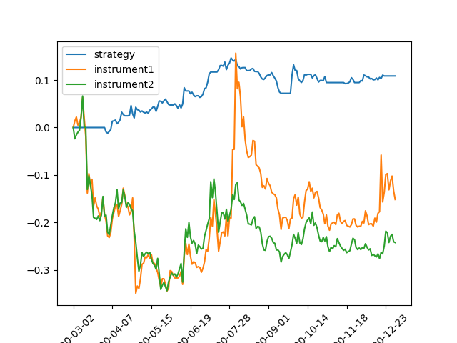
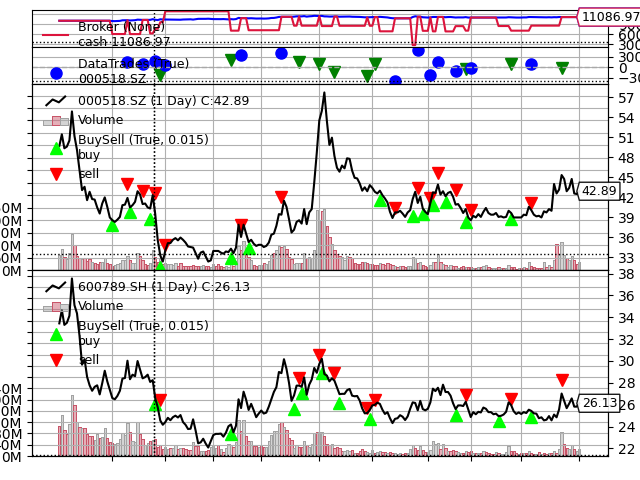

# backtrader回测
## 简介
本仓库包含多个基于backtrader框架的交易策略，旨在提供多样化的市场交易方法。每个策略都有详细的实现代码和相应的原理解释，以便于学习和研究。

## 依赖环境
- Python 3.x
- backtrader
- numpy
- pandas
- scipy
matplotlib (用于绘图)
## 安装指南
确保Python已安装在你的系统上。
使用pip安装所需的库：
```
pip install backtrader numpy pandas scipy matplotlib
```
## 策略列表
### 配对交易(pair-trading)
#### 原理
基于两个具有高度相关性的证券资产价格之间的价差。当价格偏离到一定程度时，买入被低估的股票并卖出被高估的股票，期望它们最终回归到长期均衡状态。
#### 实现步骤
1. 寻找一对具有协整关系的证券资产;
2. 当前k线下根据历史记录作线性回归, 不妨设资产X与资产Y具备以下关系:

$$y=x\beta+\epsilon$$

3. 根据残差项
$\epsilon$调整相应的买卖信号, 在时间窗口内对残差项标准化, 当标准化值大于1则多X空Y, 小于-1则多Y空X. 代码做了适当调整, 当值大于1是买入X卖出Y, 小于-1则买入Y卖出X

#### 回测曲线



